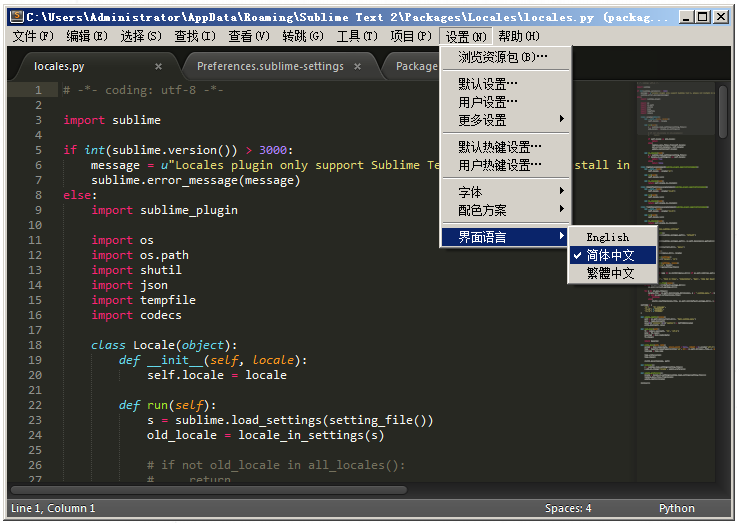

# Locales

A plugin to locale your Sublime Text UI.

**NOTE:** ONLY support Sublime Text 2 now.

## Install

### Manual

1. Download the latest version [here](https://github.com/AndorChen/sublime-locales/tags)
2. Unzip the archive
3. Start your Sublime Text
4. Open menu "Preferences - Browse Packages..."
5. Place the unzipped folder into `Packages` directory

### Package Control

1. Press `ctrl+shift+p` (Win, Linux) or `cmd+shift+p` (OS X), open the pallete
2. Type in "pckinstall", and press `Enter`
3. Type in "Locales", and press `Enter`

## Usage

### From Menu

When installed, the Locales plugin will add a menu item in "Preferences", named "UI Language". In this menu, you can choose you preferred language, like "简体中文".

### In settings file

1. Open menu "Preferences - Settings User", the user's `Preferences.sublime-settings` file will open
2. Add the setting: `"locales": "zh_CN"`

## License

[See License.md](License.md)

